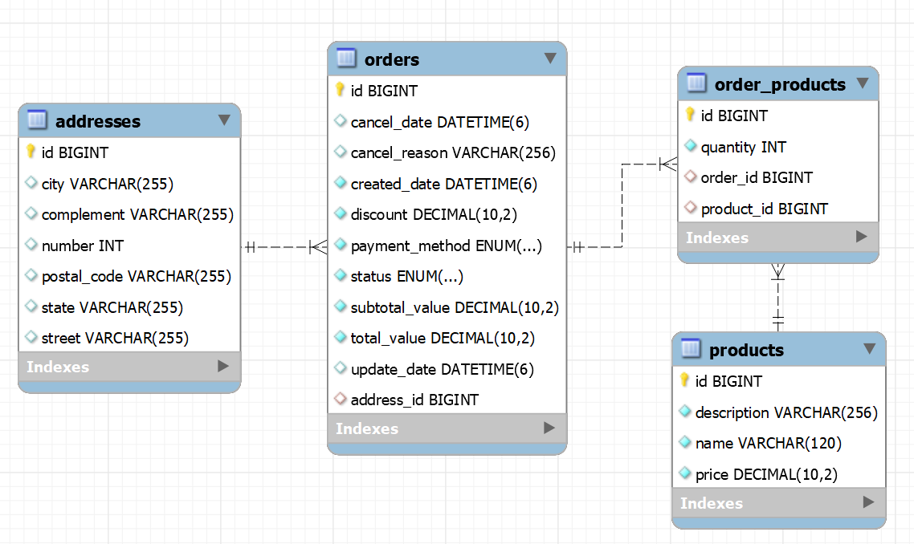

# Challenge 2 - E-commerce (CompassUOL)
O projeto consiste no desenvolvimento de uma API REST para um e-commerce, utilizando as tecnologias e conhecimentos aprendidos até o momento durante essa jornada do programa de bolsas de estágio da Compass UOL | Back-end Journey (Spring Boot) - AWS Cloud Context.

O projeto foi desenvolvimento utilizando o Java JDK na versão 17 e separado em dois domínios: **Produto (Product)** e **Pedido (Order)**.
Cada domínio possui 5 (cinco) endpoints, e foram todos documentados utilizando o Swagger.

Para testes das implementações, foi utilizado inicialmente o aplicativo Postman, cobrindo assim os testes de requisições.
Ademais, posteriormente para testes de únidades e integração, foi utilizado o JUnit 5 em conjunto com o Mockito.

**Importante:**
Não esqueça de acessar a seção [Como executar o projeto](#como-executar-o-projeto). Essa seção contem instruções e também a [Coleção do Postman](#coleção-do-postman) exportada para testes das requisições.

## Sumário
- [Challenge 2 - E-commerce (CompassUOL)](#challenge-2---e-commerce-compassuol)
  - [Tecnologias utilizadas](#tecnologias-utilizadas)
    - [Dependências](#dependências)
  - [Domínios](#domínios)
      - [Regras de negócio gerais](#regras-de-negócio-gerais)
      - [Estrutura do banco de dados](#estrutura-do-banco-de-dados)
      - [Product (Produto)](#produto-product)
        - [Regras de negócio](#regras-de-negócio)
        - [Estrutura do banco de dados](#estrutura-do-banco-de-dados)
        - [Endpoints](#endpoints)
          - [Payloads](#payloads)
          - [Exemplos de requisições](#exemplos-de-requisições)
      - [Pedido (Order)](#pedido-order)
  - [Fluxo de erros](#fluxo-de-erros)
  - [Como executar o projeto](#como-executar-o-projeto)
    - [Utilizando uma IDE (IntelliJ IDEA)](#utilizando-uma-ide-intellij-idea)
    - [Utilizando o terminal](#utilizando-o-terminal)
    - [Projeto em execução](#projeto-em-execução)
      - [Coleção do Postman](#coleção-do-postman)
  - [Conclusão](#conclusão)

## Tecnologias utilizadas
- Java JDK 17

### Dependências
- Spring Boot 3
- Spring Boot Test (inclui o JUnit 5 e Mockito)
- Spring Web
- Spring Data JPA
- Spring Validation
- Spring DevTools
- Spring Doc OpenAPI (Swagger)
- Spring Cloud OpenFeign
- ModelMapper
- Lombok
- Banco de dados H2 (utilizando apenas na camada de testes)
- Banco de dados MySQL

---
# Domínios

## Regras de negócio gerais
Apesar do projeto ter sido separado em dois domínios, ambos possuem regras de negócio em comum, sendo elas:
- Todos os campos data, devem seguir o padrão ISO 8601 (exemplo: 2023-07-20T12:00:00Z ).
- Todos os campos data, devem ser definidas automaticamente.
- As funcionalidades pedido e produto podem conter: data de cadastro ( created_date ), data de atualização ( update_date ) e data de cancelamento ( cancel_date ).
- A documentação da API ViaCEP pode ser encontrada no endereço https://viacep.com.br/

## Estrutura do banco de dados
O domínio possui a seguinte estrutura de banco de dados:



**Observações importantes sobre alterações nos requisitos do domínio Produto:**
- Os requisitos do desáfio especificavam que a coluna que armazenaria o valor do produto na tabela `products` deveria ser nomeada de `value`, porém, devido a conflitos com o banco de dados H2 pois `value` é uma palavra-chave reservada do mesmo, a coluna foi renomeada para `price`.

**Observações importantes sobre alterações nos requisitos do domínio Pedido:**
- Os requisitos do desáfio especificavam que a coluna que armazenaria o endereço de entrega do pedido na tabela `orders` deveria ser nomeada de `address`, porem visando um melhor desenvolvimento seguindo um padrão de normalização, a coluna foi renomeada para `address_id` e foi criada uma nova tabela chamada `addresses` para armazenar os endereços de entrega dos pedidos por relacionamento do banco de dados.
- Os requisitos do desáfio também especificavam que haveria uma coluna chamada `products` na tabela `orders` que armazenaria a lista de produtos do pedido, mas a nossa abordagem de desenvolvimento foi criar uma tabela intermediaria chamada `order_products` para armazenar essa lista de produtos, contendo o id do pedido e o id do produto, para que possamos ter um relacionamento entre as tabelas `orders` e `products`.

Com essas alterações, foi possível concluir o desenvolvimento do projeto de forma mais eficiente e simples.

## Produto (Product)
O domínio **Produto** consiste em uma API REST que permite que os usuários criem, leiam, atualizem e excluam produtos.

### Regras de negócio
O domínio **Produto** possui as seguintes regras de negócio:
- O nome do produto deve ser único;
- A descrição do produto deve ter no mínimo 10 caracteres;
- O valor do produto deve ser um número positivo.

### Endpoints
A API disponibiliza endpoints REST para interação. Os principais são:
- `POST /products`: Cria um novo produto.
- `GET /products`: Recupera uma lista de todos os produtos cadastrados.
- `GET /products/:id`: Recupera as informações de um produto específico.
- `PUT /products/:id`: Atualiza as informações de um produto existente.
- `DELETE /products/:id`: Deleta um produto existente.

#### Payloads

Ademais, a API possui os seguintes payloads para interação:
- `ProductCreate`: Payload utilizado para criação e atualização de um produto. Exemplo:
    ```json
    {
      "name": "Product name",
      "description": "Product description",
      "value": 10.5
    }
    ```
- `ProductResponse`: Payload utilizado para retorno de informações de um produto. Exemplo:
    ```json
    {
      "id": 1,
      "name": "Product name",
      "description": "Product description",
      "value": 10.5
    }
    ```

#### Exemplos de requisições
**Para criar um novo produto:**
- Requisição:
    ```json
    POST /products
    {
      "name": "Nome do Produto",
      "description": "Descrição do Produto",
      "value": 29.99
    }
    ```
- Resposta (Status 201 - Created):
    ```json
    {
      "id": 1,
      "name": "Nome do Produto",
      "description": "Descrição do Produto",
      "value": 29.99
    }
    ```
**Para recuperar uma lista de todos os produtos cadastrados:**
- Requisição:
    ```json
    GET /products
    ```
- Resposta (Status 200 - OK):
    ```json
    [
      {
        "id": 1,
        "name": "Nome do Produto 1",
        "description": "Descrição do Produto 1",
        "value": 29.99
      },
      // Outros produtos...
    ]
    ```

**Para recuperar informações de um produto específico:**
- Requisição:
    ```json
    GET /products/5
    ```
- Resposta (Status 200 - OK):
    ```json
    {
      "id": 5,
      "name": "Nome do Produto",
      "description": "Descrição do Produto",
      "value": 29.99
    }
    ```

**Para atualizar um produto existente:**
- Requisição:
    ```json
    PUT /products/15
    {
      "name": "Novo Nome",
      "description": "Nova Descrição",
      "value": 39.99
    }
    ```
- Resposta (Status 200 - OK):
    ```json
    {
      "id": 15,
      "name": "Novo Nome",
      "description": "Nova Descrição",
      "value": 39.99
    }
    ```

**Para deletar um produto existente:**
- Requisição:
    ```json
    DELETE /products/15
    ```
- Resposta (Status 204 - No Content):
  - Nesse caso, não há corpo de resposta, pois a resposta é sem conteúdo.

## Pedido (Order)

---
# Fluxo de erros
Para tratamento de exceções, a API possui um fluxo de erros padrão, que consiste em um payload de resposta chamado `ErrorMessage`, que possui as informações do código do erro, o _status_, a mensagem e por fim, os detalhes se existir.

Exemplo de resposta de erro, ao tentar cadastrar um produto com o nome já existente no banco de dados:
```json
{
  "code": 409,
  "status": "Conflict",
  "message": "Já existe um produto cadastrado com esse nome.",
  "details": []
}
```

Exemplo de erro ao tentar cadastrar um produto com campos mal formatados ou incompletos:
```json
{
    "code": 400,
    "status": "Bad Request",
    "message": "Campo(s) inválido(s).",
    "details": [
        {
            "field": "value",
            "message": "O valor do produto deve ser um número positivo."
        },
        {
            "field": "name",
            "message": "O nome do produto não pode estar em branco."
        }
    ]
}
```

---
# Como executar o projeto
O projeto foi desenvolvido utilizando a linguagem de programação Java, utilizando o Java Development Kit (JDK) na versão 17.
Portanto, para executar o projeto, é necessário ter o JDK 17 instalado na máquina, que pode ser baixado através do link: https://www.oracle.com/java/technologies/downloads/#java17

### Pré-configurações
Antes de executar o projeto, é necessário configurar o banco de dados MySQL, para que o projeto possa se conectar ao mesmo.

Para isso, basta acessar o arquivo ``application.properties`` localizado na pasta ``src/main/resources`` e alterar as seguintes propriedades:
- ``spring.datasource.url``: Alterar o valor da propriedade para o endereço do banco de dados MySQL.
- ``spring.datasource.username``: Alterar o valor da propriedade para o usuário do banco de dados MySQL.
- ``spring.datasource.password``: Alterar o valor da propriedade para a senha do usuário do banco de dados MySQL.

**Observação:** Alternativamente, é possível alterar essas configurações diretamente utilizando variaveis de ambiente, sendo elas:
- ``MYSQL_HOST``
- ``MYSQL_USERNAME``
- ``MYSQL_PASSWORD``

Dessa forma, não é necessário alterar o arquivo ``application.properties`` manualmente e nem recompilar o projeto.

## Utilizando uma IDE (IntelliJ IDEA)
Após instalar o JDK 17, basta abrir o projeto em uma IDE de sua preferência com suporte ao _apache maven_,
como, por exemplo, o IntelliJ IDEA, para que todas as dependências sejam baixadas.

Com o projeto aberto na IDE, basta executar a classe ``ECommerceApplication`` que contem o método ``main``, sendo a localização no pacote ``com.compassuol.sp.challenge.ecommerce``.

## Utilizando o terminal
Para executar o projeto diretamente via terminal, além do JDK 17, é necessário ter o _apache maven_ instalado na máquina, que pode ser baixado através do link: https://maven.apache.org/download.cgi

Após tudo instalado, basta abrir o terminal na pasta raiz do projeto, e executar o comando ``mvn clean install`` para que todas as dependências sejam baixadas. Após isso execute o comando ``mvn clean package`` para compilar nosso projeto.

Após a execução dos comandos acima, observe que será criado uma pasta chamada ``target`` na raiz do projeto, essa pasta contem o nosso projeto compilado, sendo nomeado de ``e-commerce-1.0-SNAPSHOT.jar``. Após entrar na pasta, basta executar o arquivo compilado do projeto utilizando o java.

Para executar o projeto, basta executar o comando ``java -jar e-commerce-1.0-SNAPSHOT.jar``.

## Projeto em execução
Com o projeto já em execução, basta acessar o endereço ``http://localhost:8080/docs-ecommerce-api.html`` para acessar a documentação da API por meio do Swagger.

### Coleção do Postman
Você tem pode importar a coleção do aplicativo Postman para testar as requisições da API, que pode ser baixada em: [CompassUOL - E-commerce Equipe 4.postman_collection.json](CompassUOL%20-%20E-commerce%20Equipe%204.postman_collection.json)

---
# Conclusão
O 2º SpringBoot Challenge representou uma oportunidade enriquecedora para a equipe CoffeWithSpring aplicar nossos conhecimentos adquiridos durante o curso do estágio na Compass UOL. Em conjunto, desenvolvemos uma API REST para um e-commerce, dividindo tarefas e colaborando de forma eficaz.

Ao utilizar tecnologias como Spring Boot, Swagger e JUnit e Mockito, conseguimos criar uma API robusta e bem documentada, seguindo as melhores práticas de desenvolvimento. Cada membro da equipe desempenhou um papel importante, contribuindo com suas habilidades e experiências para o sucesso do projeto.

Esta experiência não apenas fortaleceu nossas habilidades técnicas em desenvolvimento, mas também melhorou nossa capacidade de trabalhar em equipe e resolver problemas de forma colaborativa. Estamos orgulhosos do trabalho realizado e ansiosos para aplicar esses aprendizados em futuros desafios.

Agradecemos à Compass UOL pela oportunidade e estamos comprometidos em continuar crescendo e aprendendo juntos como equipe.

Atenciosamente,
Equipe CoffeWithSpring