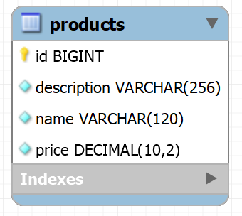

# Challenge 2 - E-commerce (CompassUOL)
O projeto consiste no desenvolvimento de uma API REST para um e-commerce, utilizando as tecnologias e conhecimentos aprendidos até o momento durante essa jornada do programa de bolsas de estágio da Compass UOL | Back-end Journey (Spring Boot) - AWS Cloud Context.

O projeto foi desenvolvimento utilizando o Java JDK na versão 17 e separado em dois domínios: **Produto** e **Pedido**.
Cada domínio possui 5 (cinco) endpoints, e foram todos documentados utilizando o Swagger.

Para testes das implementações, foi utilizado inicialmente o aplicativo Postman, cobrindo assim os testes de requisições.
Ademais, posteriormente para testes de únidades e integração, foi utilizado o JUnit 5 em conjunto com o Mockito.

## Sumário
- [Challenge 2 - E-commerce (CompassUOL)](#challenge-2---e-commerce-compassuol)
  - [Regras de negócio gerais](#regras-de-negócio-gerais)
  - [Tecnologias utilizadas](#tecnologias-utilizadas)
    - [Dependências](#dependências)
  - [Sumário](#sumário)
  - [Domínio Produto](#domínio-produto)
    - [Regras de negócio](#regras-de-negócio)
    - [Estrutura do banco de dados](#estrutura-do-banco-de-dados)
    - [Endpoints](#endpoints)
      - [Payloads](#payloads)
      - [Exemplos de requisições](#exemplos-de-requisições)
    - [Fluxo de erros](#fluxo-de-erros)
  - [Como executar o projeto](#como-executar-o-projeto)
  - [Conclusão](#conclusão)

## Regras de negócio gerais
Apesar do projeto ter sido separado em dois domínios, ambos possuem regras de negócio em comum, sendo elas:
- Todos os campos data, devem seguir o padrão ISO 8601 (exemplo: 2023-07-20T12:00:00Z ).
- Todos os campos data, devem ser definidas automaticamente.
- As funcionalidades pedido e produto podem conter: data de cadastro ( created_date ), data de atualização ( update_date ) e data de cancelamento ( cancel_date ).
- A documentação da API ViaCEP pode ser encontrada no endereço https://viacep.com.br/

## Tecnologias utilizadas
- Java JDK 17

### Dependências
- Spring Boot 3
- Spring Boot Test (inclui o JUnit 5 e Mockito)
- Spring Web e Spring Web Flux
- Spring Data JPA
- Spring Validation
- Spring DevTools
- Spring Doc OpenAPI (Swagger)
- Spring Cloud OpenFeign
- ModelMapper
- Lombok
- Banco de dados H2 (utilizando apenas na camada de testes)
- Banco de dados MySQL

---
# Domínio Produto
O domínio **Produto** consiste em uma API REST que permite que os usuários criem, leiam, atualizem e excluam produtos.

## Regras de negócio
O domínio **Produto** possui as seguintes regras de negócio:
- O nome do produto deve ser único;
- A descrição do produto deve ter no mínimo 10 caracteres;
- O valor do produto deve ser um número positivo.

## Estrutura do banco de dados
O domínio possui a seguinte estrutura de banco de dados:



**Observação Importante:** Os requisitos do desáfio especificavam inicialmente que a coluna que armazenaria o valor do produto deveria ser nomeada de `value`, porém, devido a conflitos com o banco de dados H2 pois `value` é uma palavra-chave reservada do mesmo, a coluna foi renomeada para `price`.

## Endpoints
A API disponibiliza endpoints REST para interação. Os principais são:
- `POST /products`: Cria um novo produto.
- `GET /products`: Recupera uma lista de todos os produtos cadastrados.
- `GET /products/:id`: Recupera as informações de um produto específico.
- `PUT /products/:id`: Atualiza as informações de um produto existente.
- `DELETE /products/:id`: Deleta um produto existente.

### Payloads

Ademais, a API possui os seguintes payloads para interação:
- `ProductCreate`: Payload utilizado para criação e atualização de um produto. Exemplo:
    ```json
    {
      "name": "Product name",
      "description": "Product description",
      "value": 10.5
    }
    ```
- `ProductResponse`: Payload utilizado para retorno de informações de um produto. Exemplo:
    ```json
    {
      "id": 1,
      "name": "Product name",
      "description": "Product description",
      "value": 10.5
    }
    ```

### Exemplos de requisições
**Para criar um novo produto:**
- Requisição:
    ```json
    POST /products
    {
      "name": "Nome do Produto",
      "description": "Descrição do Produto",
      "value": 29.99
    }
    ```
- Resposta (Status 201 - Created):
    ```json
    {
      "id": 1,
      "name": "Nome do Produto",
      "description": "Descrição do Produto",
      "value": 29.99
    }
    ```
**Para recuperar uma lista de todos os produtos cadastrados:**
- Requisição:
    ```json
    GET /products
    ```
- Resposta (Status 200 - OK):
    ```json
    [
      {
        "id": 1,
        "name": "Nome do Produto 1",
        "description": "Descrição do Produto 1",
        "value": 29.99
      },
      // Outros produtos...
    ]
    ```

**Para recuperar informações de um produto específico:**
- Requisição:
    ```json
    GET /products/5
    ```
- Resposta (Status 200 - OK):
    ```json
    {
      "id": 5,
      "name": "Nome do Produto",
      "description": "Descrição do Produto",
      "value": 29.99
    }
    ```

**Para atualizar um produto existente:**
- Requisição:
    ```json
    PUT /products/15
    {
      "name": "Novo Nome",
      "description": "Nova Descrição",
      "value": 39.99
    }
    ```
- Resposta (Status 200 - OK):
    ```json
    {
      "id": 15,
      "name": "Novo Nome",
      "description": "Nova Descrição",
      "value": 39.99
    }
    ```

**Para deletar um produto existente:**
- Requisição:
    ```json
    DELETE /products/15
    ```
- Resposta (Status 204 - No Content):
  - Nesse caso, não há corpo de resposta, pois a resposta é sem conteúdo.
---
# Fluxo de erros
Para tratamento de exceções, a API possui um fluxo de erros padrão, que consiste em um payload de resposta chamado `ErrorMessage`, que possui as informações do código do erro, o _status_, a mensagem e por fim, os detalhes se existir.

Exemplo de resposta de erro, ao tentar cadastrar um produto com o nome já existente no banco de dados:
```json
{
  "code": 409,
  "status": "Conflict",
  "message": "Já existe um produto cadastrado com esse nome.",
  "details": []
}
```

Exemplo de erro ao tentar cadastrar um produto com campos mal formatados ou incompletos:
```json
{
    "code": 400,
    "status": "Bad Request",
    "message": "Campo(s) inválido(s).",
    "details": [
        {
            "field": "value",
            "message": "O valor do produto deve ser um número positivo."
        },
        {
            "field": "name",
            "message": "O nome do produto não pode estar em branco."
        }
    ]
}
```

---
# Como executar o projeto
TODO

---
# Conclusão
TODO